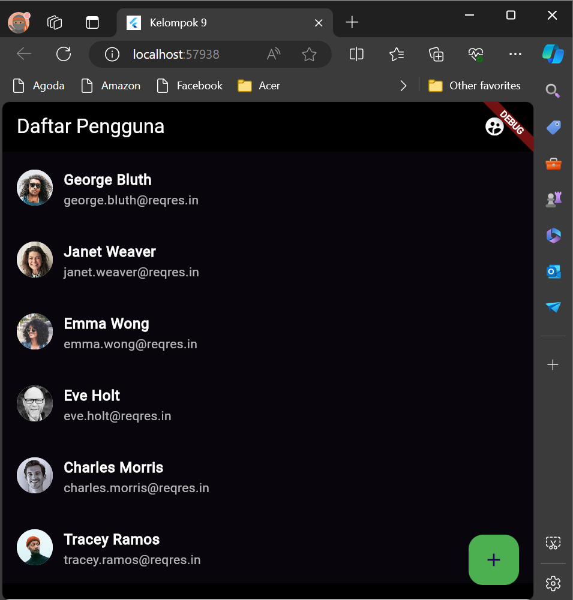
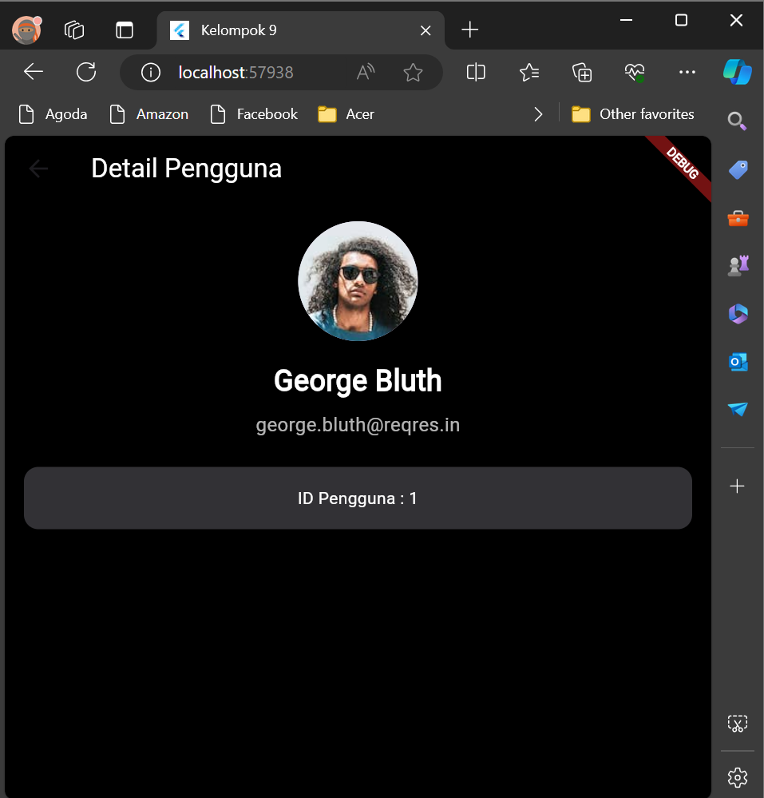
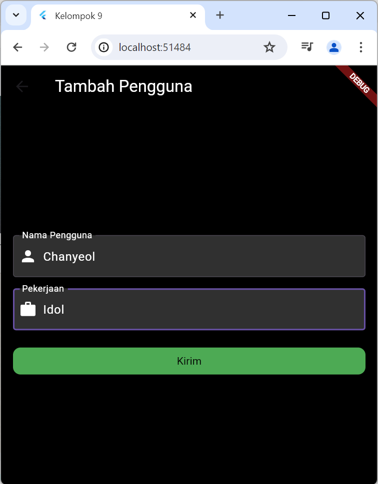
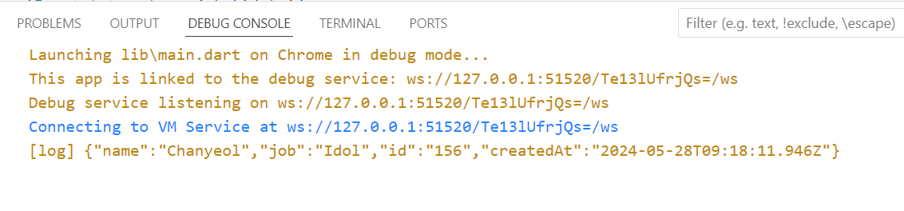
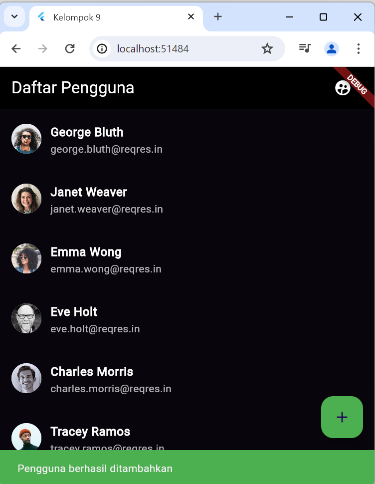
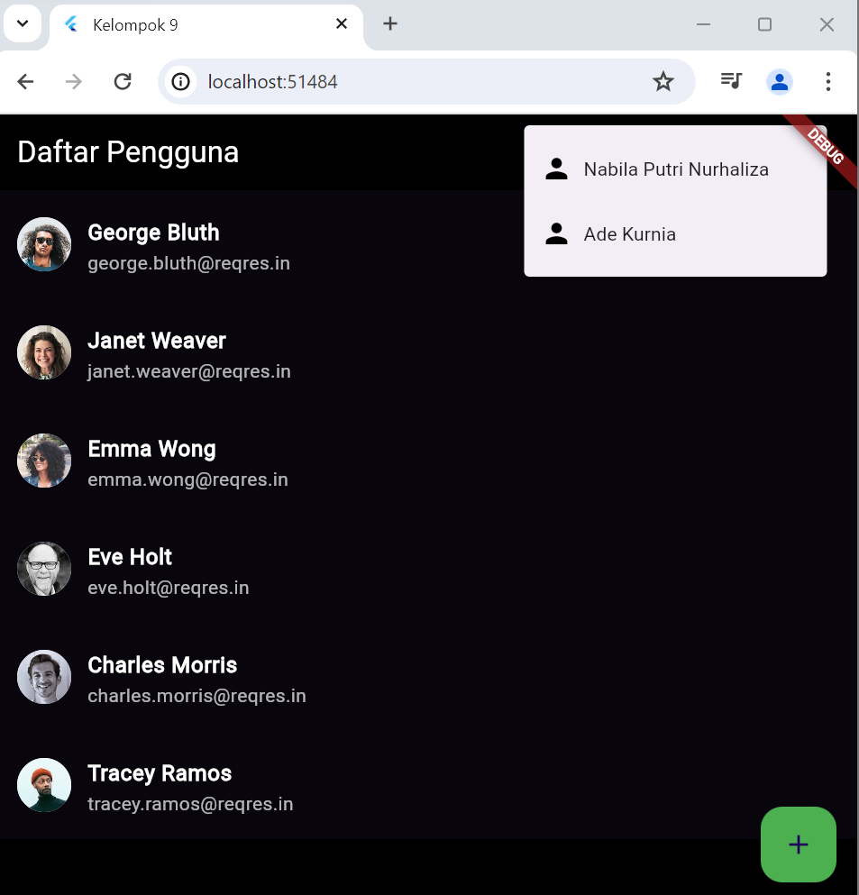

# Simple User List App

Welcome to the Simple User List App! This application is a straightforward and elegant solution for managing and viewing a list of users. It was developed by Group 9, which comprises two dedicated members.

## Team Members

- **Nabila Putri Nurhaliza (2106074)**
- **Ade Kurnia (2106029)**

## Overview

The Simple User List App is designed to fetch and display user information from an API. It showcases essential Flutter functionalities such as state management, HTTP requests, and UI design. This project serves as a learning tool and a demonstration of fundamental app development skills.

## Features

- **User List Display:** Fetches and displays a list of users with their avatars, names, and email addresses.
- **User Detail Page:** Allows users to tap on a list item to view detailed information about a selected user.
- **Add User Page:** Provides functionality to add new users to the list.
- **Popup Menu:** A popup menu in the app bar with user-specific options.

## Screenshots


*The main screen displaying the list of users.*


*The detailed view of a selected user.*


*The add user screen displaying the add user form.*


*Tampilan terminal bahwa berhasil menambahkan user.*


*Pop up berhasil menambah user.*


*Pop up ketika di klik icon user.*

## Installation

To run this project, ensure you have Flutter installed on your machine. Then, follow these steps:

1. **Clone the repository:**
    ```bash
    git clone https://github.com/yourusername/Praktikum-Pemrograman-Mobile-K9.git
    ```
2. **Navigate to the project directory:**
    ```bash
    cd Praktikum-Pemrograman-Mobile-K9
    ```
3. **Fetch the dependencies:**
    ```bash
    flutter pub get
    ```
4. **Run the app:**
    ```bash
    flutter run
    ```

## Dependencies

This project relies on the following Flutter packages:

- `flutter/material.dart`: For UI design and material components.
- `http`: For making HTTP requests to fetch user data.
- `dart:convert`: For decoding JSON responses.

## Usage

Upon launching the app, users will see a list of user profiles fetched from an API. By tapping on any user, they can view more details about the user. Users can also add new users via the floating action button on the main screen. The popup menu in the app bar provides quick access to specific user options.

## Contributing

We welcome contributions to enhance the functionality and design of this app. If you have any suggestions or improvements, feel free to submit a pull request or open an issue on GitHub.

## License

This project is licensed under the MIT License. See the [LICENSE](LICENSE) file for more details.

## Acknowledgements

- **Group 9 Members:** Nabila Putri Nurhaliza and Ade Kurnia for their dedication and hard work.
- **API Source:** [Reqres.in](https://reqres.in/) for providing the user data used in this app.
- **Flutter Community:** For the comprehensive documentation and support.

## Contact

For any inquiries or feedback, please contact us at:

- Nabila Putri Nurhaliza: [2106074@itg.ac.id](mailto:2106074@itg.ac.id)
- Ade Kurnia: [2106029@itg.ac.id](mailto:2106029@itg.ac.id)

---

We hope you find this app useful and enjoyable to use. Happy coding!
